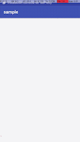

# Debug Artist


## Debug Drawer

Add a debug drawer with info about the app and some debugging tools:


To add it _without any feature_ simply adding this on each activity `onCreate`:
```
new DebugDrawer(MyApplication.sInstance, this)
```

Expand it adding features with `debugDrawer.with*`:
```
new DebugDrawer(MyApplication.sInstance, this)
        .withScalpelSwitch((ScalpelFrameLayout) findViewById(R.id.scalpel))
        .withLeakCanarySwitch(true)
        .withPicassoLogsSwitch()
        .withStethoSwitch()
        .withDivider()
        .withLynksButton()
        .withPhoenixRestartButtons(this)
        .withInputItem(2, "Host", this)
        .withSpinnerItem(1, "Spinner with item selected by index", hosts, 0, this)
        .withSpinnerItem(3, "Spinner with 2nd item selected", hosts, "Value", this)
        .withDivider()
        .withInfoProperties(getProperties())
```
### Features:

For each feature you need to setup it correctly, sometimes no extra work is needed.
Features:
- [Links](https://github.com/pedrovgs/Lynx)
- [Leakcanary](https://github.com/square/leakcanary)
- [Picasso logs](https://github.com/square/picasso): enable debug logs.
- [Scalpel](https://github.com/JakeWharton/scalpel)
- [Stetho](https://github.com/facebook/stetho): if you want custom interceptors you can add them and it will use them _automatically_.
- [Process Phoenix](https://github.com/JakeWharton/ProcessPhoenix)
- Custom spinners: used sometimes to select from a list of hosts.
- Custom text input fields: used sometimes to set the app host.

* ViewServer: helps to debug layouts

## Use it 

Include it in your `gradle.properties`:

```
repositories {
  maven {
      url 'http://archiva.barista-v.com:8080/repository/internal/'
      credentials {
        username "${NEXUS_USERNAME}"
        password "${NEXUS_PASSWORD}"
      }
  }
}

dependencies {
  devCompile 'com.barista_v:debug_artist:<version>@aar'
}
```


## Publish

1. Check `gradle.properties` and `lib/gradle.properties` for POM setup.
1. Run: `scripts/publish.sh`

## Thanks to
- [gradle-mvn-push](https://raw.github.com/danielgomezrico/gradle-mvn-push/master/gradle-mvn-push.gradle)
- And all the feature developers!