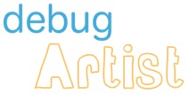

[](https://bintray.com/barista-ventures/maven/debug-artist/_latestVersion)
[](https://codecov.io/gh/BaristaVentures/debug-artist)
[](https://codecov.io/gh/BaristaVentures/debug-artist)
[](https://codebeat.co/projects/github-com-baristaventures-debug-artist)

This library helps you as a developer to expose important information about the current build to your test users, in case you make builds for
test users.
 
Check [Debug Drawer Menu](docs/debug-drawer.md).

- __Note:__ check [sample](sample/) for a working project using this library to see how it works.

Contains [ViewServer](https://github.com/romainguy/ViewServer) to help you to debug layouts with more devices.

## Add to gradle project

```groovy
repositories { jcenter() }
dependencies { compile("com.baristav.debugartist:debugartist:<library-version>@aar") { transitive = true } }
```

## Thanks to
- All feature developers!
- [Barista Ventures](http://barista-v.com/)
- [AndroidTool-mac](https://github.com/mortenjust/androidtool-mac): helped to create the gif from device.
- [ImageOptim](https://github.com/ImageOptim/ImageOptim): optimize gif generated from ^^ :P
