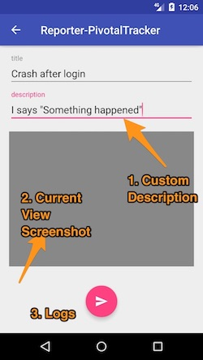

# Shake to Report Bug

This feature try to help your tester users report bugs into your team with all the needed data
you need (device info, screenshots, logs, tags, etc).

Flow:
1. *Tester/You* want to report a bug to your team.
1. *Tester/You* shake the device with the `debug-artist`.
1. *Tester/You* touch send.
1. Bug `Card/Story` is created in your third party ticket system.

All your `Card/Story` will be created with:

- Device Logs.
- Current screen screenshot. 
- Custom title/description.
- Default tags if able.
- Default properties (api host url, or any variable data you want to see)

Sample of report view:



If enabled device shake will take an screenshot and start a new activity with the provided `BugReporter.Builder`. 
This builder enable the menu to send the repository to the new activity and then build it there.

The idea is to allow custom bug repositories so build your own!
Supported third party `Card/Story` trackers:

- [Pivotal Tracker](https://www.pivotaltracker.com/)
- Trello (soon)
- Github (soon)
- Any Idea?

# How to use it

1. Add the library you need (in this case `pivotal tracker reporter`)

```groovy
debugCompile("com.baristav.debugartist:reporter_pivotal:0.6.1@aar") { transitive = true }
```

2. Create the instance of the `Builder` you need, in this case will be the `PivotalBugRepositoryBuilder`:


- From Kotlin:
```
val repositoryBuilder = PivotalBugRepositoryBuilder("project-key",
        "project-id", 
        propertiesToInclude,
        defaultTags);
```

- From Java:
```java
PivotalBugRepositoryBuilder repositoryBuilder = 
    new PivotalBugRepositoryBuilder("project-key",
            "project-id", 
            propertiesToInclude,
            defaultTags);

```

3. Add the button with the builder to  

- From Kotlin:
```kotlin
val debugDrawer = DebugDrawer(MyApplication.sInstance, this)
        //...
        .withShakeToReportBugSwitch(false, repositoryBuilder)        
```

- From Java:
```java
DebugDrawer debugDrawer = new DebugDrawer(MyApplication.sInstance, this)
        //...
        .withShakeToReportBugSwitch(false, repositoryBuilder)
```

# How to create your custom Bug Report Repository

You will need to create 2 classes that inherit from:
- `BugRepository.Builder`: know how to build the repository with its dependencies. Added to allow
the menu to send the dependencies to the report bug activity, build it and use it there.

- `BugRepository`: the repository itself that know how to use the custom service api to create.
