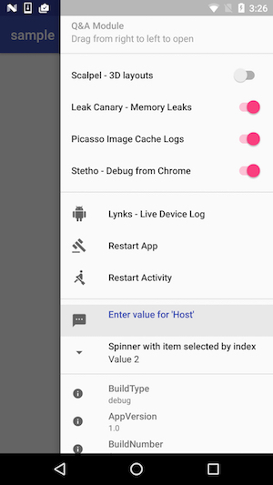

# Debug Drawer



## How to use it

Add this on each activity `setContentView` so your child activities always add it to each activity:

```
mDebugDrawer = DebugDrawer(MyApplication.sInstance, this)
        .withScalpelSwitch(findViewById(R.id.scalpelLayout) as ScalpelFrameLayout)
        .withLeakCanarySwitch(true)
        .withPicassoLogsSwitch(true)
        .withStethoSwitch(true)
        .withShakeToReportBugSwitch(false, repositoryBuilder)
        .withDivider()
        .withLynksButton()
        .withPhoenixRestartButton(this)
        .withDivider()
        .withInputItem(2, "Host", this)
        .withSpinnerItem(1, "Spinner with item selected by index", hosts, 0, this)
        .withDivider()
        .withInfoProperties(properties)
```

### Features:

- Shake it to Report Bug

On shake takes an screenshot and let you create a bug in your favorite story/bug tracker,
and [you can use custom services](custom-bug-report-service.md).

Current repositories:

  * `PivotalTrackerRepository`: uploads to pivotal tracker.

  ```groovy
  repositories { jcenter() }
  dependencies { compile("com.baristav.debugartist:reporter-pivotaltracker:<library-version>@aar") { transitive = true } }
  ```

- Custom spinners: used sometimes to select from a list of hosts.
- Custom text input fields: used to set the app api host dynamically.
- Custom map of properties: map of `title` -> `content` that allow you to show  useful info about the app like version, current host, flavor, etc...
- [Links](https://github.com/pedrovgs/Lynx): show logcat live phone.
- [Picasso logs](https://github.com/square/picasso): enable debug logs.
- [Scalpel](https://github.com/JakeWharton/scalpel): see 3d layouts.
- [Stetho](https://github.com/facebook/stetho): if you want custom interceptors you can add them and it will use them _automatically_.
- [Process Phoenix](https://github.com/JakeWharton/ProcessPhoenix): restart app/activity.
- [Leakcanary](https://github.com/square/leakcanary): track Memory leaks.

You need to avoid other thing initialization on `Application` `onCreate` since LeakCanary creates another process and
may cause crashes:

```
class MyCustomApp {

    @Override
    void onCreate(){
      if (LeakCanary.isInAnalyzerProcess(this)) return // <-------------- This

      // Setup Firebase
      // Setup Other Services
    }

}
```